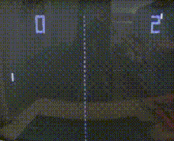

## Pong Game
***

> Pong is a two-dimensional sports game that simulates table tennis. The player controls an in-game paddle by moving it vertically across the left or right side of the screen. They can compete against another player controlling a second paddle on the opposing side. Players use the paddles to hit a ball back and forth. The goal is for each player to reach eleven points before the opponent; points are earned when one fails to return the ball to the other.

<p align="center"> 
	
</p>

> Here ***Right Paddle*** is controlled by ***Up and Down arrow *** keys whereas ***Left Paddle*** is controlled by ***w and s*** keys

> Have fun playing the game


> Run the main.py file
```
>> python main.py

```
