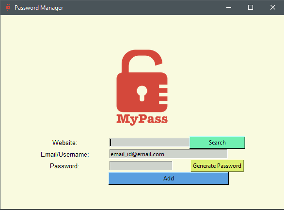

## Password Manager
***

> This project is based on securing your passwords for websites which you can store securely and can search without any hassle.

<p align="center">
	
</p> 

> <i>You can store your ***website name, email and password*** or you can generate a secure random password with just one click.</i>

> You can get your credentials by just providing your ***website*** and it will fetch the details and also the password will be copied to your clipboard helping you to paste your password in appropriate places.


> First Install ***pyperclip*** module

```
>> pip install pyperclip
```

> Run the password_manager.py 
```
>> python password_manager.py

```
