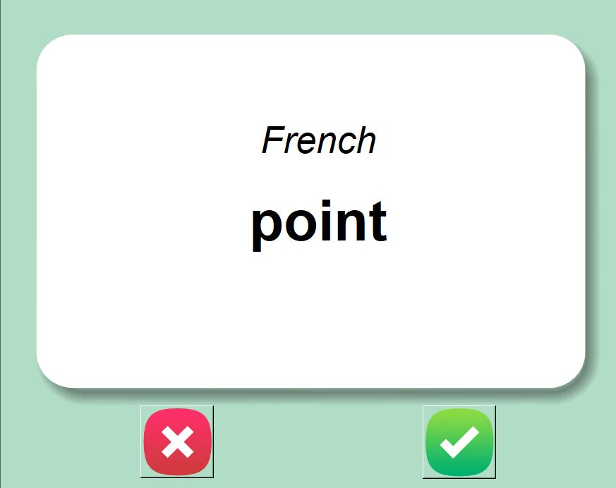

## Learning French
***

> This project is a Flash Card App which helps you in learning French. The application first shows you a card with a french word in it and displays it for 3 seconds, If you know the meaning of the word, you may click on the ***Right*** button, else click on the ***Wrong*** button.

> If you do not know the word, you may wait for 3 seconds and the meaning of the word will show in English and as you now know the meaning of the you may wish to click ***right button*** or choose ***wrong button*** so that you may take another round for that word.

> Happy Learning

<br>

> Install pandas module first

```
>> pip install pandas
```

> Run the flash_card.py file 
```
>> python flash_card.py

```

> The project looks like this

<p align="center">
	 <br><br>
	
</p>

***

***